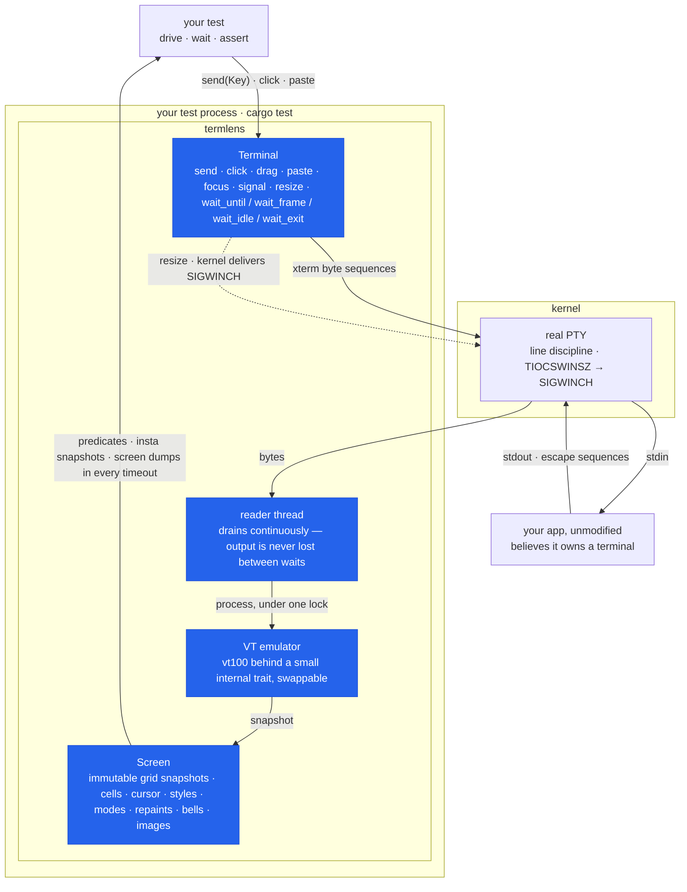

# termlens

Integration testing for terminal programs, done the way you'd test a web
app: spawn the real thing in a **real PTY**, let a VT emulator render its
output into an in-memory **screen grid**, and **assert or snapshot on the
rendered screen** instead of scraping raw bytes. Playwright for the
terminal.

[](https://github.com/vyncint/termlens/actions/workflows/ci.yml)
[](https://crates.io/crates/termlens)
[](https://docs.rs/termlens)
[](https://github.com/vyncint/termlens/blob/main/Cargo.toml)
[](#license)

```sh
cargo add termlens --dev
cargo add insta --dev    # used by the snapshot assertions below
```

Add `--features decode` if you test an application that draws inline images
and want to assert on the pixels it transmitted.

## Example

```rust
use std::time::Duration;
use termlens::{Key, Terminal};

#[test]
fn quits_from_the_main_screen() -> termlens::Result<()> {
    let mut t = Terminal::builder()
        .size(80, 24)
        .env_clear()                       // hermetic: no host env leaks in
        .timeout(Duration::from_secs(5))   // every wait_* has this deadline
        .spawn(env!("CARGO_BIN_EXE_myapp"))?;

    t.wait_until(|screen| screen.contains("Ready"))?;
    insta::assert_snapshot!(t.screen());   // snapshot the rendered grid
    // …or t.screen().with_styles() to catch style-only regressions too

    t.send(Key::Char('q'))?;
    assert!(t.wait_exit()?.success());
    Ok(())
}
```

When a wait times out, the error embeds the screen — your CI log shows
exactly what the app was displaying, not "assertion failed: false".

## What it is (and is not)

- **Not** an expect-style stream matcher — [rexpect] and [expectrl] already
  do that well. Byte streams can't answer "is the cursor on the third menu
  item?".
- **Not** an SVG transcript generator for pretty docs — that's
  [term-transcript].
- **It is**: a real PTY + an emulated screen + snapshot assertions, so you
  test what a user would *see*.

## How it works



The reader thread drains the PTY into the emulator *continuously* — the
kernel buffer can't fill up and stall your app, and no output is lost
between assertions. It also **answers the queries real terminals
answer** — cursor position, device attributes, window size, background
colour, `DECRQM` mode probes, and terminfo capabilities via `XTGETTCAP` —
so capability-probing apps run instead of hanging, and anything left
unanswered is named inside the next timeout error. Every answer is
truthful or absent: nothing is claimed that the emulator cannot render.

Input is **mode-aware**: mouse clicks and scrolls, pastes, modifier
chords, and cursor keys are encoded exactly as the application
configured its terminal (SGR mouse, bracketed paste, DECCKM) — because
the emulator knows which modes the app enabled. A `drag` reports one
motion **per cell crossed**, so an application that paints along the path
sees the path. The same knowledge is
readable from every `Screen`: the window title, the alternate-screen
flag, the input modes, the last `OSC 52` clipboard write, the cursor
shape the app asked for with `DECSCUSR`, and the `OSC 8` hyperlinks it
emitted are plain accessors, so "did the app enter the alt screen?",
"did it copy the right text?", "did it put the terminal into insert
mode — and put it back?" and "did it link the right URL?" are
assertions, not inferences. The last two matter because neither changes
a cell: a hyperlink's label renders as ordinary text with its URL
nowhere on the screen, so before `links()` a test asserting a link
passed identically against an application that emitted none. Focus events go the other way:
`focus_out()` reaches an application that enabled mode 1004, so the
unfocused branch of a UI can be driven at all.

**Behaviour that leaves the screen identical is still assertable.** A
repaint that drew nothing, a bell on a rejected key, an inline image — none
of these change a single cell, so no content predicate can see them. Every
`Screen` carries the counters instead: `repaints()` (completed DEC 2026
updates, so *one input became four repaints* is catchable), `bells()`, and
`graphics()` for kitty and sixel payloads — where the assertion is as often
the negative one, "this must render as text in every terminal and never go
out as an image". `frame_timings()` adds the cost of each repaint, so a
suite can hold a performance line as well as a correctness one.

**And an image is more than a byte count.** `graphics().payloads()` hands
back the transmissions themselves — where each was placed, the size and
cell extent it declared, its format and id — so an application that lays
out in characters and draws in pixels can be held to keeping the two in
step. Images are counted as *images*: a transmission split across the kitty
protocol's 4096-byte chunks is one, and a delete is counted apart, under
`deletes()`, because it carries no picture. With the `decode` feature a
payload decodes into a `Bitmap`, so the assertion can finally be about the
picture:

```rust
let seen = screen.graphics();
let image = seen.last().expect("the chart went out as an image");
assert_eq!(image.cells(), Some((106, 7)));       // on the cells reserved
assert_eq!(image.at(), (4, 5));                  // at the grid's origin
assert_eq!(image.decode()?.pixel(9, 9), Some([0x39, 0xd3, 0x53, 0xff]));
```

**Scrollback is retained** (1000 rows by default), so an application that
hands finished output *back* to the terminal — a pager, a log view, a TUI
that commits completed blocks into native scrollback and keeps a small
live region — stays testable. `full_text()` spans history and screen, so
an assertion need not know which region a block currently sits in.

Screens are immutable snapshots taken under the same
lock the reader writes through, so every assertion sees a consistent
instant. Four layers, one small internal trait between emulator and screen
so the backend can be swapped; details in [docs/DESIGN.md](docs/DESIGN.md).

## Comparison

| Tool                  | Real PTY | Screen grid | Snapshots | Notes                                   |
| --------------------- | :------: | :---------: | :-------: | --------------------------------------- |
| **termlens**          |    ✔     |      ✔      |     ✔     | this crate                              |
| [rexpect] / [expectrl] |   ✔     |      ✗      |     ✗     | stream matching, no rendered screen     |
| [term-transcript]     |    ✗     |      ~      |   SVG     | transcripts for docs, not assertions    |
| ratatui `TestBackend` |    ✗     |      ✔      |     ~     | in-process only: your real binary, PTY layer, and non-ratatui output stay untested |
| [teatest] (Go)        |    ✔     |      ✔      |     ✔     | same idea, Bubble Tea / Go ecosystem    |

## Determinism

PTYs are asynchronous; a harness that pretends otherwise is flaky by
design. termlens's position:

- **Prefer `wait_until` on visible content.** It re-checks on every chunk
  of output and is exact: the condition either becomes true or you get a
  screen-carrying timeout. The three rules for race-free waits (and the
  resize stale-frame trap) are in [docs/DESIGN.md](docs/DESIGN.md) §2.
- **Styles are complete enough to catch a masked field.** `Style` carries
  `blink`, `conceal` and `strikethrough` alongside the usual attributes, so
  a test asserting that a password field is masked fails against an
  application that prints the secret in clear — the two are identical text.
- **Needles are matched by what the terminal draws, not by how it is
  spelled.** `contains` and `find` fold both sides to NFC, so a needle typed
  in an editor still finds text an application normalized the other way —
  `caf\u{e9}` and `cafe\u{301}` render identically, and so does the failure
  output, which made the mismatch a trap rather than a limitation. The grid
  itself keeps exactly the codepoints the application sent.
- **`wait_frame` gives exact frame boundaries** for apps that bracket
  repaints in DEC 2026 synchronized updates (crossterm's
  `BeginSynchronizedUpdate`/`EndSynchronizedUpdate`): the predicate only
  ever sees complete frames, never a torn repaint, and the call returns
  the frame it matched. Each call observes a frame no earlier call did, so
  a burst arriving in one read is assertable step by step in emission
  order, one repaint cannot satisfy two waits, and a superseded frame
  cannot answer a wait made after your input. Applications that *probe*
  for synchronized output before using it get a truthful `DECRQM` answer,
  so they enable it against termlens unmodified.
- **Every wait takes a per-call deadline** (`wait_until_for`,
  `wait_frame_for`, `wait_idle_for`, `wait_exit_for`), so one slow step
  doesn't force a generous timeout on the whole suite. Writes are bounded
  too, and every input call returns `Result`: typing into an application
  that has stopped reading, or into a child that has exited, is an error
  carrying the screen rather than a hang or a panic.
- **`wait_idle(quiet)` is an honest heuristic** for everything else. It
  resolves when nothing arrived for `quiet`, the stream isn't
  mid-escape-sequence, and no synchronized update is open. Silence is
  evidence a render finished — not proof. Use it for "the app settled",
  not for precise sequencing.
- **Hermetic environments.** `env_clear()` blocks inheritance,
  `TERM=xterm-256color` is pinned by default, fixtures draw no clocks and
  no animations. The CI suite runs a 100-iteration
  [stress workflow](.github/workflows/stress.yml) on Linux and macOS —
  wait/timing changes don't merge without surviving it.

## Known limitations (v0.6)

- Scrollback is **bounded** (1000 rows by default), **text only** — a
  scrolled-off row has no styles and no cell addressing — and is **not
  reflowed** by a `resize`. The visible grid stays the fully-featured
  surface.
- `wait_frame` needs the application to bracket its repaints in DEC 2026
  synchronized updates, and only the last 8 completed frames are retained;
  everything else waits with `wait_until`, under the three rules in
  [docs/DESIGN.md](docs/DESIGN.md) §2.
- Some questions stay deliberately unanswered — kitty's `CSI ? u`, DECRQSS,
  DA3, `OSC 12`, `OSC 52` *reads*, and the non-pixel `CSI … t` reports —
  because a guessed reply is worse than none. An application blocked on one
  is **named in the next timeout** rather than left to hang unexplained.
- **Graphics are captured, not rendered.** termlens can tell an application
  that kitty or sixel is available (`graphics()`, `cell_size()`), collect
  what it then transmits, and — with the `decode` feature — decode a payload
  into pixels. It still draws none: an image never reaches the screen grid,
  so what a picture looks like *composited over the text under it* is not
  assertable, and `f=100` (PNG) payloads are reported unsupported rather
  than decoded, since termlens carries no image codec. Retention is bounded
  (4 MiB by default, `capture_graphics`); past it a payload is counted and
  described but its bytes are dropped, and it says so rather than decoding a
  prefix of itself. Support stays opt-in, so by default an application that
  probes is truthfully told there is none.
- **A reply the terminal's own input queue cannot hold may not arrive.**
  termlens no longer drops answers of its own accord, but the tty input
  queue is small (~1 KB on macOS, ~4 KB on Linux), so an application that
  asks thousands of questions without reading has to read as it asks — as
  it would against a real terminal. On Linux the kernel discards silently,
  so that loss is undetectable and goes unreported; macOS blocks instead,
  where it is counted and named.
- Unix only for now (Linux + macOS in CI). The PTY layer (`portable-pty`)
  supports ConPTY, so Windows is planned, not designed out.
- A child that writes and exits within its first milliseconds can lose
  output to the OS PTY teardown (macOS especially). Long-lived TUIs are
  unaffected; for run-and-exit programs, end the script with a `read` and
  release it after asserting — see the "instant-exit caveat" in
  [docs/DESIGN.md](docs/DESIGN.md).
- Exotic grapheme clusters render as the vt100 crate renders them; the
  unicode-torture fixture pins the current behavior.

## MSRV

Rust **1.85** (driven by the default `insta` feature's dependency tree;
checked in CI against the committed lockfile). MSRV bumps are minor
releases.

## Contributing

PRs welcome — see [CONTRIBUTING.md](CONTRIBUTING.md) (dev setup, testing
policy, DCO sign-off, AI tooling policy) and
[docs/DESIGN.md](docs/DESIGN.md) before touching wait semantics. Security
reports: [SECURITY.md](SECURITY.md).

## License

Licensed under either of [Apache License, Version 2.0](LICENSE-APACHE) or
[MIT license](LICENSE-MIT) at your option — the Rust ecosystem's standard
dual license. Apache-2.0 carries an express patent grant; MIT is maximally
simple and GPLv2-compatible. Offering both lets every downstream user pick
whichever their project or policy needs. Unless you explicitly state
otherwise, any contribution intentionally submitted for inclusion in the
work by you, as defined in the Apache-2.0 license, shall be dual licensed
as above, without any additional terms or conditions.

[rexpect]: https://crates.io/crates/rexpect
[expectrl]: https://crates.io/crates/expectrl
[term-transcript]: https://crates.io/crates/term-transcript
[teatest]: https://github.com/charmbracelet/x/tree/main/exp/teatest
