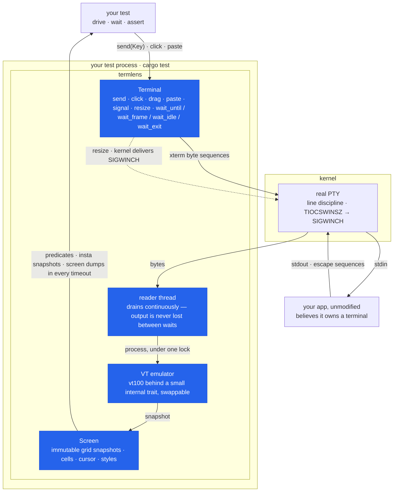

# termlens

Integration testing for terminal programs, done the way you'd test a web
app: spawn the real thing in a **real PTY**, let a VT emulator render its
output into an in-memory **screen grid**, and **assert or snapshot on the
rendered screen** instead of scraping raw bytes. Playwright for the
terminal.

[](https://github.com/vyncint/termlens/actions/workflows/ci.yml)
[](https://crates.io/crates/termlens)
[](https://docs.rs/termlens)
[](https://github.com/vyncint/termlens/blob/main/Cargo.toml)
[](#license)

```sh
cargo add termlens --dev
cargo add insta --dev    # used by the snapshot assertions below
```

## Example

```rust
use std::time::Duration;
use termlens::{Key, Terminal};

#[test]
fn quits_from_the_main_screen() -> termlens::Result<()> {
    let mut t = Terminal::builder()
        .size(80, 24)
        .env_clear()                       // hermetic: no host env leaks in
        .timeout(Duration::from_secs(5))   // every wait_* has this deadline
        .spawn(env!("CARGO_BIN_EXE_myapp"))?;

    t.wait_until(|screen| screen.contains("Ready"))?;
    insta::assert_snapshot!(t.screen());   // snapshot the rendered grid
    // …or t.screen().with_styles() to catch style-only regressions too

    t.send(Key::Char('q'));
    assert!(t.wait_exit()?.success());
    Ok(())
}
```

When a wait times out, the error embeds the screen — your CI log shows
exactly what the app was displaying, not "assertion failed: false".

## What it is (and is not)

- **Not** an expect-style stream matcher — [rexpect] and [expectrl] already
  do that well. Byte streams can't answer "is the cursor on the third menu
  item?".
- **Not** an SVG transcript generator for pretty docs — that's
  [term-transcript].
- **It is**: a real PTY + an emulated screen + snapshot assertions, so you
  test what a user would *see*.

## How it works



The reader thread drains the PTY into the emulator *continuously* — the
kernel buffer can't fill up and stall your app, and no output is lost
between assertions. It also **answers the queries real terminals
answer** (cursor position, device attributes, window size, background
color), so capability-probing apps run instead of hanging — and anything
left unanswered is named inside the next timeout error.

Input is **mode-aware**: mouse clicks and scrolls, pastes, modifier
chords, and cursor keys are encoded exactly as the application
configured its terminal (SGR mouse, bracketed paste, DECCKM) — because
the emulator knows which modes the app enabled. The same knowledge is
readable from every `Screen`: the window title, the alternate-screen
flag, and the input modes are plain accessors, so "did the app enter the
alt screen?" is an assertion, not an inference.

Screens are immutable snapshots taken under the same
lock the reader writes through, so every assertion sees a consistent
instant. Four layers, one small internal trait between emulator and screen
so the backend can be swapped; details in [docs/DESIGN.md](docs/DESIGN.md).

## Comparison

| Tool                  | Real PTY | Screen grid | Snapshots | Notes                                   |
| --------------------- | :------: | :---------: | :-------: | --------------------------------------- |
| **termlens**          |    ✔     |      ✔      |     ✔     | this crate                              |
| [rexpect] / [expectrl] |   ✔     |      ✗      |     ✗     | stream matching, no rendered screen     |
| [term-transcript]     |    ✗     |      ~      |   SVG     | transcripts for docs, not assertions    |
| ratatui `TestBackend` |    ✗     |      ✔      |     ~     | in-process only: your real binary, PTY layer, and non-ratatui output stay untested |
| [teatest] (Go)        |    ✔     |      ✔      |     ✔     | same idea, Bubble Tea / Go ecosystem    |

## Determinism

PTYs are asynchronous; a harness that pretends otherwise is flaky by
design. termlens's position:

- **Prefer `wait_until` on visible content.** It re-checks on every chunk
  of output and is exact: the condition either becomes true or you get a
  screen-carrying timeout. The three rules for race-free waits (and the
  resize stale-frame trap) are in [docs/DESIGN.md](docs/DESIGN.md) §2.
- **`wait_frame` gives exact frame boundaries** for apps that bracket
  repaints in DEC 2026 synchronized updates (crossterm's
  `BeginSynchronizedUpdate`/`EndSynchronizedUpdate`): the predicate only
  ever sees complete frames, never a torn repaint, and the call returns
  the frame it matched. Each call observes a frame no earlier call did, so
  a burst arriving in one read is assertable step by step in emission
  order, one repaint cannot satisfy two waits, and a superseded frame
  cannot answer a wait made after your input. Applications that *probe*
  for synchronized output before using it get a truthful `DECRQM` answer,
  so they enable it against termlens unmodified.
- **Every wait takes a per-call deadline** (`wait_until_for`,
  `wait_frame_for`, `wait_idle_for`, `wait_exit_for`), so one slow step
  doesn't force a generous timeout on the whole suite. Writes are bounded
  too: typing into an application that has stopped reading fails with the
  screen attached instead of hanging.
- **`wait_idle(quiet)` is an honest heuristic** for everything else. It
  resolves when nothing arrived for `quiet`, the stream isn't
  mid-escape-sequence, and no synchronized update is open. Silence is
  evidence a render finished — not proof. Use it for "the app settled",
  not for precise sequencing.
- **Hermetic environments.** `env_clear()` blocks inheritance,
  `TERM=xterm-256color` is pinned by default, fixtures draw no clocks and
  no animations. The CI suite runs a 100-iteration
  [stress workflow](.github/workflows/stress.yml) on Linux and macOS —
  wait/timing changes don't merge without surviving it.

## Known limitations (v0.3)

- No scrollback assertions, and resizing does not reflow scrollback — the
  visible grid is the testable surface.
- Unix only for now (Linux + macOS in CI). The PTY layer (`portable-pty`)
  supports ConPTY, so Windows is planned, not designed out.
- A child that writes and exits within its first milliseconds can lose
  output to the OS PTY teardown (macOS especially). Long-lived TUIs are
  unaffected; for run-and-exit programs, end the script with a `read` and
  release it after asserting — see the "instant-exit caveat" in
  [docs/DESIGN.md](docs/DESIGN.md).
- Exotic grapheme clusters render as the vt100 crate renders them; the
  unicode-torture fixture pins the current behavior.

## MSRV

Rust **1.85** (driven by the default `insta` feature's dependency tree;
checked in CI against the committed lockfile). MSRV bumps are minor
releases.

## Contributing

PRs welcome — see [CONTRIBUTING.md](CONTRIBUTING.md) (dev setup, testing
policy, DCO sign-off, AI tooling policy) and
[docs/DESIGN.md](docs/DESIGN.md) before touching wait semantics. Security
reports: [SECURITY.md](SECURITY.md).

## License

Licensed under either of [Apache License, Version 2.0](LICENSE-APACHE) or
[MIT license](LICENSE-MIT) at your option — the Rust ecosystem's standard
dual license. Apache-2.0 carries an express patent grant; MIT is maximally
simple and GPLv2-compatible. Offering both lets every downstream user pick
whichever their project or policy needs. Unless you explicitly state
otherwise, any contribution intentionally submitted for inclusion in the
work by you, as defined in the Apache-2.0 license, shall be dual licensed
as above, without any additional terms or conditions.

[rexpect]: https://crates.io/crates/rexpect
[expectrl]: https://crates.io/crates/expectrl
[term-transcript]: https://crates.io/crates/term-transcript
[teatest]: https://github.com/charmbracelet/x/tree/main/exp/teatest
