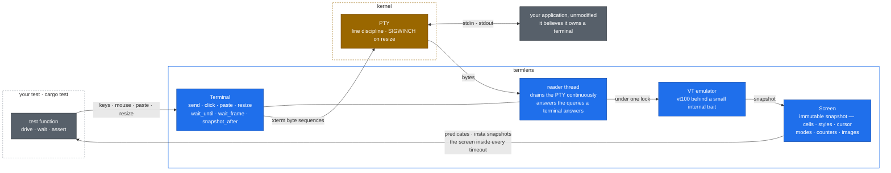

# termlens

**Integration testing for terminal programs, the way you would test a web
app.** termlens spawns your real binary in a real pseudo-terminal, renders
its output through a VT emulator into an in-memory screen grid, and lets a
test wait on, assert against and snapshot that grid — what a user would
*see*, not the bytes that produced it.

[](https://github.com/vyncint/termlens/actions/workflows/ci.yml)
[](https://crates.io/crates/termlens)
[](https://docs.rs/termlens)
[](#stability-and-versioning)
[](#license)

Ratatui's [snapshot-testing recipe](https://ratatui.rs/recipes/testing/snapshots/)
includes a termlens example for testing a compiled application through a PTY.
Use it alongside `TestBackend` snapshots to cover interactions and process
behaviour.

## Why

An in-process widget test renders your `draw` function into a buffer. It is
fast and precise, and it cannot see anything between `draw` and the user's
eyes. termlens is the second layer, for a small number of end-to-end flows
through the real binary:

- **Terminal state** — raw mode and the alternate screen entered and left,
  the cursor restored after `q` or a panic, the modes the application turned
  on and whether it turned them off.
- **What is actually drawn** — box drawing, colours, wide characters, a
  password field that is *concealed* rather than printed in clear, a stray
  `println!` or panic message that never went through the framework.
- **Real input and real signals** — keys, mouse and paste encoded exactly as
  the terminal encodes them under the modes the application enabled; a
  `SIGWINCH` that the application must survive.
- **Behaviour that changes no cell** — a repaint that drew nothing, a bell on
  a rejected key, an image that went out as pixels when it should have been
  text.

Every wait is deadline-bounded, and every failure carries the screen: a CI
log shows what the application was displaying, not `assertion failed:
false`.

## Quick start

```sh
cargo add termlens --dev
cargo add insta --dev    # used by the snapshot assertions below
```

```rust
use std::time::Duration;
use termlens::{Key, Terminal};

#[test]
fn quits_from_the_main_screen() -> termlens::Result<()> {
    let mut t = Terminal::builder()
        .size(80, 24)
        .env_clear()                       // hermetic: no host env leaks in
        .timeout(Duration::from_secs(5))   // every wait_* has this deadline
        .spawn(env!("CARGO_BIN_EXE_myapp"))?;

    // Wait for the app's ready marker, let the picture settle, then snapshot
    // it with its styles — the three decisions every TUI snapshot needs.
    termlens::assert_screen_snapshot!(t, after = |s| s.contains("Ready"));

    t.send(Key::Char('q'))?;
    assert!(t.wait_exit()?.success());
    Ok(())
}
```

That builder chain is what every test of a package's own binary starts
from, so it has a name: `termlens::bin!("myapp")` spawns
`CARGO_BIN_EXE_myapp` at 80×24 with a cleared environment and a five-second
deadline; builder calls after the name override any of it —
`termlens::bin!("myapp", size(120, 40), env("NO_COLOR", "1"))?`.

Optional features: `decode` (inline images as pixels), `regex` (patterns over
screen rows), `serde` (a `Screen` as JSON). `insta` is on by default and
provides `assert_screen_snapshot!`.

## How it works



Four layers. A **reader thread** drains the PTY into the emulator
continuously, so the kernel buffer never fills and stalls the application,
and no output is lost between assertions. It also **answers the queries a
real terminal answers** — cursor position, device attributes, window size,
background colour, `DECRQM` mode probes, `XTGETTCAP` — so
capability-probing applications run instead of hanging; anything left
unanswered is named inside the next timeout. Every **`Screen`** is an
immutable snapshot taken under the same lock the reader writes through, so
an assertion sees one consistent instant. The emulator sits behind a small
internal trait; `vt100` is the backend, with a second parser recovering the
three style attributes it drops (blink, conceal, strikethrough). The
mechanics, and the reasoning behind each decision, are in
[docs/DESIGN.md](https://github.com/vyncint/termlens/blob/main/docs/DESIGN.md).

## Waiting without flakes

PTYs are asynchronous. There is no `sleep` in termlens, and every wait
returns either the thing you asked for or a timeout carrying the screen.

| Call | Resolves when | Reach for it when |
| --- | --- | --- |
| `wait_until(pred)` | `pred(&screen)` is true — re-checked on every chunk of output | content appears; the default |
| `wait_frame(pred)` | a **complete** DEC 2026 frame satisfies `pred`; returns that frame, and each call sees a frame no earlier call did | the application brackets repaints in synchronized updates (crossterm's `BeginSynchronizedUpdate`) |
| `snapshot_after(pred)` | `pred` holds and the picture has then held still; returns that screen | a whole-screen snapshot — what `assert_screen_snapshot!` uses |
| `wait_stable(quiet)` | no cell, cursor or size change for `quiet`; returns the screen | settling after a resize, or without a predicate |
| `wait_idle(quiet)` | no **bytes** for `quiet`, not mid-sequence, no update open | output silence is itself the fact; a heuristic, and documented as one |
| `wait_exit()` | the process ended; returns its `ExitStatus` | the end of every test |

Every wait has a `_for(…, timeout)` twin for one slow step. Input calls are
bounded too: typing into an application that has stopped reading, or into a
child that has exited, is an error carrying the screen rather than a hang.
The three rules for race-free waits — one predicate per instant, wait on
the last thing painted, settle before whole-screen snapshots — are
[docs/DESIGN.md](https://github.com/vyncint/termlens/blob/main/docs/DESIGN.md) §2.

## Snapshots that survive volatile content

A clock in the title bar or a PID in the status line would break a snapshot
on every run, and a text filter over the rendering shifts every column after
it. Mask the **grid** instead — width, styles and cursor stay put:

```rust,ignore
let s = t.snapshot_after(|s| s.contains("Ready"))?;
insta::assert_snapshot!(s.mask_matching("12:34:56", '▒'));   // a literal…
insta::assert_snapshot!(s.mask_rect(70.., ..1));              // …a rectangle…
// …or a pattern, with the `regex` feature:
insta::assert_snapshot!(s.mask_matches(&regex::Regex::new(r"\d\d:\d\d:\d\d")?, '▒'));
```

`Screen::diff(&other)` reports what changed between two screens cell by
cell — `changed_rows()`, `style_changes()`, and a rendering of only the rows
that changed; `Screen::parse` reads a saved snapshot back, so the text
termlens prints — an insta `.snap`, the block a wait error leaves in a log,
what `termlens inspect` writes to stdout — is also its input format.

## What a test can see

| Question | Accessors |
| --- | --- |
| What does the user see? | `text()`, `row_text(row)`, `cell(row, col)`, `contains`, `find`, `find_all`; with `regex`: `matches`, `find_match`, `wait_until_matches` |
| Is it styled as claimed? | `cell(..).style()` — colours, bold/dim, italic, underline, reverse, **blink**, **conceal**, **strikethrough** |
| Where is the cursor, and what shape? | `cursor()`, `cursor_visible()`, `cursor_shape()`, `cursor_blink()` |
| Which modes did the application turn on? | `alternate_screen()`, `bracketed_paste()`, `mouse_mode()`, `focus_events()`, `application_cursor()`, `insert_mode()` |
| What did it tell the terminal out of band? | `title()`, `clipboard()` (`OSC 52`), `links()` (`OSC 8`) |
| Did something happen that changed no cell? | `repaints()`, `bells()`, `visual_bells()`, `graphics()`, `frame_timings()` |
| What scrolled off? | `scrollback_text()`, `full_text()`, `locate(needle)`, `logical_text()`, `row_wrapped(row)` |
| Did the emulator understand everything it was sent? | `unsupported()` — every sequence it did not implement, so a plausible grid can be told from a right one |

**Input is mode-aware.** `send(Key)`, modifier chords, `paste`, `click`,
`drag` (one motion per cell crossed), `scroll` with modifiers, `focus_in`
/`focus_out`, `resize` and `signal` are encoded exactly as the application
configured its terminal — SGR mouse, bracketed paste, DECCKM — because the
emulator knows which modes it enabled.

**Images are captured, not composited.** `graphics()` reports every kitty
and sixel transmission — placement, declared size and cell extent, format,
id — and with the `decode` feature a payload decodes into a `Bitmap`:

```rust
let seen = screen.graphics();
let image = seen.last().expect("the chart went out as an image");
assert_eq!(image.cells(), Some((106, 7)));       // on the cells reserved
assert_eq!(image.at(), (4, 5));                  // at the grid's origin
assert_eq!(image.decode()?.pixel(9, 9), Some([0x39, 0xd3, 0x53, 0xff]));
```

**Scrollback is retained** (1,000 rows by default; text only unless
`scrollback_styles(true)`), so pagers and log views that hand finished
output back to the terminal stay testable.

## Command line and CI

`cargo install termlens-cli` gives the same harness as a command:

```sh
termlens inspect --size 120x40 myapp     # run a program, print its screen
termlens diff old.snap new.snap.new      # the cell diff; exit 1 if anything changed
termlens render --svg failing.snap       # a saved screen as SVG, HTML, ANSI or text
```

In CI, set `TERMLENS_ARTIFACT_DIR` on the test step and every screen a
failing wait embeds is also written there. The report action then puts
those screens, and every `.snap.new` with its diff, into the pull request's
step summary:

```yaml
- run: cargo test
  env:
    TERMLENS_ARTIFACT_DIR: ${{ runner.temp }}/termlens
- uses: vyncint/termlens/.github/actions/report@v0.10.1
  if: failure()
```

## Comparison

| Tool | Real PTY | Screen grid | Snapshots | Notes |
| --- | :-: | :-: | :-: | --- |
| **termlens** | ✔ | ✔ | ✔ | this crate |
| [rexpect] / [expectrl] | ✔ | ✗ | ✗ | stream matching; termlens's `regex` feature offers `wait_until_matches` over a *row of the screen* |
| [term-transcript] | ✗ | ~ | SVG | transcripts for documentation, not assertions |
| ratatui `TestBackend` | ✗ | ✔ | ~ | in-process: the real binary, the PTY layer and non-ratatui output stay untested |
| [teatest] (Go) | ✔ | ✔ | ✔ | the same idea for Bubble Tea |

`TestBackend` is the right tool for layout and rendering logic, and
termlens does not replace it. What it structurally cannot observe, and the
termlens assertion that does:

| Invisible to `TestBackend` | The assertion that sees it |
| --- | --- |
| raw-mode entry and exit, the alternate screen | `t.wait_until(\|s\| s.alternate_screen())`, and `!alternate_screen()` after `q` |
| a resize reaching the application | `t.resize(60, 14)?; t.wait_frame(\|s\| s.contains("60x14"))` |
| output outside ratatui — a `println!`, a logger, a panic | `s.contains("panicked")`, or a snapshot of the whole grid |
| a torn frame | `wait_frame` returns complete DEC 2026 frames only |
| capability probes and the modes they turn on | `answer_queries` replies as a terminal would; `s.mouse_mode()`, `s.bracketed_paste()` say what was asked for |
| mouse and paste bytes under the enabled modes | `t.click(col, row)`, `t.scroll(…)`, `t.paste(…)` encode for the mode the app turned on |
| a masked field that is really printed in clear | `cell.style().conceal` — identical text, different picture |
| the terminal state after exit | `t.wait_exit()?` then `t.screen()`: `!alternate_screen()`, cursor visible again |

`fixtures/ratatui-app` is the worked example: one `draw` rendered through
the PTY by termlens and in-process by `TestBackend`, diffed cell by cell
with `Screen::diff` at two sizes with a resize between. Where they disagree,
the bug is in the terminal layer — the layer nothing else tests.

## Platform support

| | Linux | macOS | Windows (ConPTY) |
| --- | :-: | :-: | :-: |
| Screen assertions — grid, styles, cursor, modes, title, links, resize, typed input, `wait_until` / `wait_stable` / `snapshot_after`, `bin!` | ✔ | ✔ | ✔ |
| Frame assertions — `wait_frame`, `frame_timings`, `record` | ✔ | ✔ | — |
| Graphics, mouse modes, focus events, `Terminal::signal`, the responder's outbound claims | ✔ | ✔ | — |

ConPTY renders the child's output into a screen of its own and re-emits
that, so what termlens claims on Windows is what survives the re-render.
The whole suite runs on `windows-latest` as a required check; each test the
platform cannot honour is `#[cfg_attr(windows, ignore = "…")]` with the
reason. The measurement is `tests/conpty_probe.rs`; the decision is
[docs/STABILITY.md](https://github.com/vyncint/termlens/blob/main/docs/STABILITY.md) §1.

## Stability and versioning

**0.11.0 is the stability candidate**: from that release no promised item
changes incompatibly before 1.0. A change that must break one ships as a
new candidate (0.12.0) with a migration table and restarts the observation
window in [#335](https://github.com/vyncint/termlens/issues/335); a patch
release does not. 1.0 follows the readiness criteria in that issue, not a
date.

[docs/STABILITY.md](https://github.com/vyncint/termlens/blob/main/docs/STABILITY.md)
states what is promised — the documented public API in every supported
feature configuration, the snapshot text format, the versioned JSON, the
CLI's commands, flags, exit codes and input formats — which job or test
checks each part, what follows a dependency's versioning instead, and what
is deliberately not promised; and the three decisions, with their
measurements, that 1.0 rests on.

**MSRV is Rust 1.85**, set by the default `insta` feature's dependency tree
and checked in CI against the committed lockfile; a bump is a minor
release. The `ratatui-app` fixture alone needs 1.88 and is not part of the
published crate.

## Limitations

The short list; the full one, with the reason behind each entry, is
[docs/LIMITATIONS.md](https://github.com/vyncint/termlens/blob/main/docs/LIMITATIONS.md).

- Terminal dimensions are 2–1000 cells per axis.
- `wait_frame` needs the application to bracket repaints in DEC 2026
  synchronized updates; the last 8 completed frames are retained.
- Scrollback is bounded (1,000 rows), text-only unless asked, and **not
  reflowed** on resize.
- Graphics are captured and decodable, never composited onto the grid;
  PNG payloads are reported as unsupported rather than decoded.
- Hyperlinks are recorded as spans, not attributed to cells.
- Overline and double underline are not modelled; bold and dim are one
  intensity state.
- A child that writes and exits within its first milliseconds can lose
  output to PTY teardown (macOS especially); end such scripts with a `read`.

## For coding agents

Agents write terminal tests badly in predictable ways — a `sleep` where a
wait belongs, a snapshot taken mid-repaint, `(row, col)` handed to a method
that wants `(col, row)`. [`skills/termlens/SKILL.md`](https://github.com/vyncint/termlens/blob/main/skills/termlens/SKILL.md)
is the counter to each: the model, the rules, the API on one page and four
recipes. Every Rust block in it is compiled against the crate in CI.

```sh
mkdir -p ~/.claude/skills/termlens && curl -sSL https://raw.githubusercontent.com/vyncint/termlens/main/skills/termlens/SKILL.md -o ~/.claude/skills/termlens/SKILL.md
```

Other agents take the same file — a Cursor rule, or a reference from
`.github/copilot-instructions.md`.

## Documentation

| | |
| --- | --- |
| [docs/DESIGN.md](https://github.com/vyncint/termlens/blob/main/docs/DESIGN.md) | the four layers, wait semantics and the three rules, the snapshot text format, why the emulator is where it is |
| [docs/STABILITY.md](https://github.com/vyncint/termlens/blob/main/docs/STABILITY.md) | what 1.0 means, and what the promise covers |
| [docs/LIMITATIONS.md](https://github.com/vyncint/termlens/blob/main/docs/LIMITATIONS.md) | everything termlens does not model or claim, with reasons |
| [docs/BACKENDS.md](https://github.com/vyncint/termlens/blob/main/docs/BACKENDS.md) | the emulator comparison behind keeping `vt100` |
| [skills/termlens/SKILL.md](https://github.com/vyncint/termlens/blob/main/skills/termlens/SKILL.md) | the agent skill: rules, API cheat sheet, recipes |
| [CHANGELOG.md](https://github.com/vyncint/termlens/blob/main/CHANGELOG.md) | every release, breaking changes under **Changed** / **Removed** |
| [docs.rs](https://docs.rs/termlens) | the API reference |

## Contributing

Pull requests are welcome — [CONTRIBUTING.md](https://github.com/vyncint/termlens/blob/main/CONTRIBUTING.md) has the dev
setup, the testing policy and the DCO sign-off. Three things to know before
starting: every change lands with tests; anything touching wait semantics
must pass the 100-iteration [stress workflow](https://github.com/vyncint/termlens/blob/main/.github/workflows/stress.yml)
on Linux, macOS and Windows; snapshot updates are reviewed diffs
(`cargo insta review`), never blind accepts. Security reports go to
[SECURITY.md](https://github.com/vyncint/termlens/blob/main/SECURITY.md).

## License

Licensed under either of [Apache License, Version 2.0](https://github.com/vyncint/termlens/blob/main/LICENSE-APACHE) or
[MIT license](https://github.com/vyncint/termlens/blob/main/LICENSE-MIT) at your option. Unless you explicitly state
otherwise, any contribution intentionally submitted for inclusion in the
work by you, as defined in the Apache-2.0 license, shall be dual licensed as
above, without any additional terms or conditions.

[rexpect]: https://crates.io/crates/rexpect
[expectrl]: https://crates.io/crates/expectrl
[term-transcript]: https://crates.io/crates/term-transcript
[teatest]: https://github.com/charmbracelet/x/tree/main/exp/teatest
