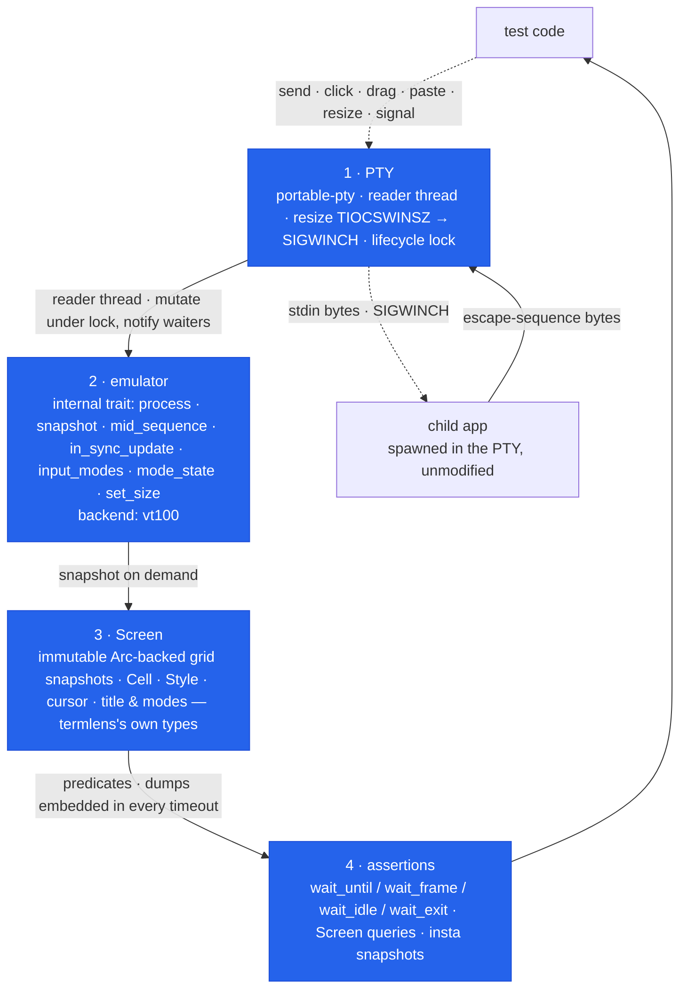

# termlens — Design

Condensed architecture notes. This document is the contract for anything
touching wait semantics, the snapshot format, or the emulator boundary —
change those only with a matching change here.

## 1. Four layers



Data flows up (solid): child writes → PTY master → reader thread →
emulator → screen snapshots → assertions. Input flows down (dashed),
encoded to match the modes the application enabled (§6) → PTY master →
child.

**The reader thread** is the linchpin. It drains the PTY *continuously*, not
just inside `wait_*` calls, so a chatty program can never fill the kernel
PTY buffer and deadlock, and no output is lost "between" waits. It owns
nothing but a reader handle and the shared `Monitor<EmuState>` (mutex +
condvar): every chunk is fed to the emulator under the lock, then waiters
are notified. On EOF (child exited and released the terminal — reported as
0-read on macOS, EIO on Linux) it sets the `eof` flag and exits. It is
never joined: a grandchild holding the PTY open must not hang `Drop`.

### The reader answers queries

Applications ask their terminal questions — DSR `CSI 6 n` (cursor
position), DA1/DA2 (device attributes), `CSI 18 t` (text-area size),
`OSC 10/11 ; ?` (colors) — and block on the reply. A mute harness turns
every capability probe into a hang. termlens therefore answers, by
default, exactly what a real terminal answers and nothing more: the DA1
identity is VT220-with-color (`?62;22c`), claiming no feature the
emulator cannot render, and kitty's `CSI ? u` probe is deliberately left
unanswered because its protocol resolves via the DA1 reply, exactly as
on a real non-kitty terminal.

`DECRQM` ("is private mode *n* set?") is answered too, and answering it
is what lets an application that *probes* before using synchronized
output turn it on against termlens — so `wait_frame` can work against a
program nobody modified for us. Every reply is truthful or absent:
modes whose state the emulator holds exactly report set/reset, and
anything else reports "not recognized" rather than a guess.

The mouse tracking modes show where that line actually falls. The
backend collapses `9`/`1000`/`1002`/`1003` into one mutually exclusive
value, so it cannot say which members of a group an application set —
crossterm's `EnableMouseCapture` sends three at once and only the last
survives. But that ambiguity exists only *while something is tracking*.
With no tracking mode active — the state every application probes from
at startup — nothing was collapsed and every tracking mode is genuinely
reset, so that is what we report. Answering "not recognized" there
would close a loop on itself: the application concludes the terminal has
no mouse, never enables tracking, and `click` then refuses, blaming the
application for a decision we caused.

`OSC 52` is the one sequence we **capture** rather than answer. A write
(`OSC 52 ; targets ; base64`) is not a question, and the only evidence a
test could otherwise see is the application's own toast — which proves the
code path ran and nothing about the payload, when the payload is the
behaviour under test. So the decoded most-recent write lands on the
snapshot (`Screen::clipboard`), with the target selections exactly as the
application named them, since writing to the wrong one is a real bug. A
payload we cannot decode — bad base64, not UTF-8, or past the capture
bound — reports as `None` and never as `Some("")`: a test asserting an
empty clipboard must not pass on something we failed to read. Clipboard
*reads* (`OSC 52 ; … ; ?`) are questions, and stay named-but-unanswered
like the rest.

Precision: the emulator stops consuming at each query byte (the same
mechanism as frame boundaries), so a cursor-position report reflects the
cursor *at the query*, not after later output in the same chunk moved
it. Replies are built under the state lock but written after it is
released — the state lock and the writer lock are never held together.

**Nothing writes to the child on a thread that cannot afford to wait.**
Every write — query replies and typed input alike — is handed to a
dedicated writer thread over a bounded queue. Typed input carries an
acknowledgement channel, so the test thread applies the terminal's
deadline and returns `Error::Write` with the screen ("the application is
not reading its input") instead of blocking forever; there is no portable
way to ask whether a PTY write *would* block, since `POLLOUT` on a macOS
master reports writable and then blocks anyway.

Which failures are errors and which are panics is a deliberate split, not
an accident of history. `send`/`send_str`/`paste`/`click`/`drag`/`scroll`
all return `Result`, because *whether the child is still there to receive
input* is a fact about the run, discovered at runtime, and a test may
legitimately want to handle it. `Key::F(13)` still panics, because there
is no thirteenth function key on any terminal and never will be: that is a
mistake in the test's own source, and the same category as indexing a
slice out of bounds. Environmental failures are errors; impossible
arguments are panics.

Replies go to that same thread, fire-and-forget: writing them from the
reader thread would block whenever the application stopped reading its
input; the drain would stop, the child would then block writing into a
full output buffer, and the harness would deadlock itself with no test
input involved. A full queue means the application is not reading at
all — so it cannot be waiting on those bytes — and the replies are
counted and named in the next wait's error instead.

Whatever remains unanswered (XTGETTCAP, pixel-size reports, …) is
recorded, and the next wait timeout names it: "the application queried
the terminal (`^[[14t`) and received no answer" — a hang becomes a
diagnosis. `answer_queries(false)` mutes the responder for tests that
need a silent terminal; the diagnosis still works.

## 2. Wait semantics

Every wait runs under the terminal's **default deadline** (builder
`timeout`, 5s default) or a per-call one: each `wait_*` has a `_for` twin
(`wait_until_for`, `wait_frame_for`, `wait_idle_for`, `wait_exit_for`), so
one known-slow step does not force its deadline on the whole suite. There
is deliberately no unbounded wait: a hung TUI in CI must produce a readable
failure, not a 6-hour job timeout. On expiry the error **embeds the full
screen dump** — a CI log alone answers "what was the app showing?".

- `wait_until(pred)` — re-evaluates `pred` on a fresh snapshot whenever the
  reader delivers bytes (condvar notification), with a 50ms poll cap as a
  missed-wakeup backstop. Fails fast with `Error::Eof` the moment the PTY
  closes while `pred` is false: more waiting can never succeed.
- `wait_frame(pred)` — evaluates `pred` **only on complete frames**. The
  sequence tracker recognizes DEC private mode 2026 (`CSI ?2026 h/l`,
  including multi-mode lists); the reader splits each chunk at every
  frame end and snapshots the screen *at that instant*, so the predicate
  sees exactly the frame as the app finished it — even when the same read
  already carries the next frame's opening bytes. It **returns the frame
  it matched**, so the assertion lands on the instant the predicate saw
  rather than on a `screen()` taken afterwards, which can already be a
  newer state.

  The last **8** completed frames are retained, and each call scans —
  oldest first — only those *newer than the frame it last returned*. That
  one cursor gives both properties that matter: a burst arriving in one
  read is assertable step by step in the order the application drew it
  (asking backwards fails, so the sequence is enforced rather than
  merely available), and a frame cannot satisfy two waits. A frame
  completed before the call but never yet returned *is* still matched —
  deliberately, so a fast application cannot slip one past you between
  two waits — but a *superseded* frame no longer can, which is what makes
  `send(key); wait_frame(old_state)` fail instead of passing on stale
  content. `resize` advances the cursor too: a frame drawn at the old
  size is not the repaint that answers the new one.

  Honest caveat: a burst longer than the retention bound drops its
  oldest frames. A frame is one *completed* update — an End that closes a
  Begin we saw, so the `?2026l` in a defensive mode-reset string is not a
  repaint — and a Begin/End pair that changed nothing still counts, since
  the count is of repaints rather than of changes. An app that never
  emits a synchronized update makes the timeout error say so and point at
  `wait_until`.
- `wait_idle(quiet)` — resolves when **no bytes for `quiet`** AND the
  stream does not end mid-escape-sequence (or mid-UTF-8-character) AND no
  synchronized update is open (a begun-but-unfinished DEC 2026 repaint is
  by definition mid-update). The sequence conditions come from a minimal
  tracker (`emu/seq.rs`) — not a VT parser, just enough state to answer
  "did the stream stop inside an update?". EOF counts as idle. An
  application that opens an update and never closes it therefore times out
  here, and the message says exactly that instead of "waiting for 100ms of
  output silence", which reads as nonsense against a quiet terminal.
  **This is a heuristic**: silence is evidence of a finished render, not
  proof. Prefer `wait_until` on visible content, or `wait_frame` where the
  app uses synchronized output.
- `wait_exit()` — polls `try_wait` on a capped backoff ladder (1→20ms),
  then grace-drains the PTY (≤500ms) so the final screen is complete
  before returning. Idempotent via a cached status.

`Drop` kills + reaps the child unconditionally (unless already reaped):
tests never leak zombies, including on panic.

### `screen()` is the live grid, frames or no frames

`wait_frame` is the only frame-gated observation in the crate. `screen()`
returns the grid as it stands, and "as it stands" can be **inside** a
repaint — for an application that brackets every repaint in DEC 2026
exactly as intended, just as much as for one that never heard of
synchronized output. Open an update, paint row 1, and a snapshot taken
there has row 1 and nothing else. The application did everything right
and still gets the pre-2026 failure mode.

This is deliberate, and the alternative is worse. Serving the newest
*complete* frame from `screen()` while an update is open would mean that
a `wait_until` predicate could match content the following `screen()`
does not show — the predicate reads the live grid, so it sees the
half-painted row that the substituted frame lacks. Disagreeing with your
own predicate is a nastier failure than tearing. And the torn read is
positively wanted in one case: an application hung mid-repaint is
diagnosed by seeing the half-painted grid, which is why timeout and
`Error::Eof` screens keep showing it.

So the honest answer is three routes to a frame-consistent screen, each
matching a way of waiting:

| you waited with | use |
|---|---|
| `wait_frame` | the `Screen` it returns — the matched frame, complete by construction |
| `wait_until` | `wait_idle` after it (no idleness while an update is open), then `screen()` |
| neither | a predicate naming the last thing the app paints, so its truth implies the repaint finished |

### The three rules for race-free waits

`wait_until(pred)` guarantees exactly one thing: every byte up to and
including the ones that made `pred` true has been processed. Nothing in
the byte stream marks where a repaint ends, so the predicate can fire on
a half-painted screen — **including half a row**. The first real user hit
exactly that (the [termlens-demo coverage
study](https://github.com/vyncint/termlens-demo/blob/main/docs/TERMLENS-COVERAGE.md),
§2):

```rust
t.wait_until(|s| s.contains("NORMAL"))?;      // status bar, last row
assert!(t.screen().contains("Tasks 1/10"));   // the SAME row — still in flight
```

This failed roughly 2 runs in 15 under parallel load: `NORMAL` had
landed; ` Tasks 1/10 …`, the rest of the same row, was still crossing
the PTY. Three rules make such waits deterministic:

1. **Put everything you assert into one predicate.** A `Screen` is one
   consistent instant; two waits are two instants with a race between
   them. The fix for the failure above is race-free by construction:

   ```rust
   t.wait_until(|s| s.contains("NORMAL") && s.contains("Tasks 1/10"))?;
   ```

2. **Wait on the last thing painted.** Before snapshotting a whole
   screen, wait on the **final** thing the app draws — the rightmost
   text of the bottom row, or the cursor's resting position
   (`s.cursor() == (row, 0, true)`) — never a line drawn midway. Which
   text is "last" is a property of *your app's* render order; termlens
   cannot tell you. Waiting on an early marker and snapshotting is a
   race at chunk boundaries; the stress workflow found exactly that in
   our own suite.
3. **Settle before whole-screen snapshots.** A snapshot asserts on cells
   the test never named, so no targeted predicate can cover it; call
   `wait_idle` first. That is a heuristic (silence ≠ proof of a finished
   render — see above), and it is the honest tool for the job.

Applications that bracket repaints in DEC 2026 synchronized updates need
none of this discipline: `wait_frame` evaluates predicates only on
complete frames.

### The resize stale-frame trap

Rule 1 has one non-obvious failure mode after `resize`. The emulated
grid resizes immediately — but its *content* is still the old frame,
merely clipped (or reflowed) to the new geometry, until the application
handles SIGWINCH and repaints. Both halves of this predicate are true of
the **stale** frame:

```rust
t.resize(50, 20)?;
t.wait_until(|s| s.cols() == 50 && s.contains("tasks (10)"))?;   // ← matches old content
```

`s.cols() == 50` holds from the moment `resize` returns, and the
clipped old frame still says `tasks (10)` — the wait resolves before
the app has repainted at all. Wait for something only the
post-SIGWINCH frame can show — content that needs the new width, a
complete status bar on the new bottom row — or use `wait_frame` where
the app emits synchronized updates, which is now unconditionally safe
here: `resize` advances the frame cursor, so only a frame completed
*after* the resize can satisfy the wait.

### The instant-exit caveat (macOS PTY teardown)

A child that **writes and exits within its first milliseconds** races the
platform's PTY teardown: on macOS, bytes still buffered in the kernel when
the slave side closes can be discarded, and teardown can even surface as a
signal-death instead of the real exit code. Stress-testing found this at
roughly 1 in 80 instant-exit spawns under load. termlens narrows the window
as far as userspace allows — the reader thread is attached *before* the
child is spawned — but cannot close it.

The deterministic pattern (used throughout our own suite): make the child's
last action a `read` on stdin, assert on its output, then send Enter and
`wait_exit`. Real TUI applications are unaffected — they live far longer
than the window and exit on request.

Related, and fixed inside the library: macOS tears PTYs down with
`revoke()` and recycles PTY device numbers immediately, so with concurrent
terminals one thread's teardown could revoke another thread's *freshly
opened* PTY and kill its child at birth (~1/800 spawns under CI load; the
same suite ran 100/100 on Linux). termlens therefore serializes every PTY
lifecycle edge — open+spawn on one side, kill+reap+close on the other —
behind a process-wide lock (`PTY_LIFECYCLE` in `terminal.rs`). The lock is
held for microseconds per edge; steady-state I/O never touches it.

### Scrollback

A `Screen` carries the rows that have scrolled off the top, so content the
application handed back to the terminal stays assertable:
`scrollback_rows()`, `scrollback_text()`, and `full_text()` — history
followed by the visible screen, which is the assertion an author actually
writes when the application moves content between a live region and
native scrollback as it runs. Every other query on `Screen` (`contains`,
`find`, `cell`, `text`) is visible-screen only, unchanged.

Two design constraints shaped this. First, **a snapshot is a fixed
observation**, and vt100 models scrollback as a *stateful view* —
`set_scrollback(n)` moves an offset so the same accessors read history. So
the view is moved only inside `process`, under `&mut`, while bytes are
being consumed, and always restored before anyone can observe the grid; no
`Screen` ever depends on parser state read later. Second, **snapshots are
taken on every wait evaluation**, so history is materialized once per
chunk that scrolled rather than per snapshot, and is kept as shared text
rather than cells — a thousand rows of styled cells per snapshot would
dominate the cost of every wait, and history is asserted on for its
content.

Below the retention length the history only grows, so a chunk that
scrolled nothing costs one length check. At the length, vt100 evicts from
the front and its length stops changing, so growth is no longer visible
there — and there is no sound cheap substitute, since consecutive
identical rows are ordinary output and comparing the ends of the history
would miss real scrolls. So at the bound the window vt100 still holds is
re-read, which is by definition the newest N rows. Measured on 50,000
lines through an 80x24 screen: 352ms with retention off, 327ms below the
bound (free, within noise), 639ms on the re-read path.

Two limits are documented rather than papered over: history is bounded, so
a longer run drops its oldest rows; and resize does not reflow, so rows
keep the width they were captured at. The alternate screen accumulates no
history at all (vt100 gives the alternate grid none), which is what makes
retention safe to default on for full-screen TUIs.

## 3. Snapshot text format (spec)

`Display for Screen` produces:

```
size: 80x24  cursor: 2,3
╭──────────────────────────────╮
│ repoatlas                    │
│ > main.go                    │
╰──────────────────────────────╯
```

Rules:

1. Header line first: `size: <cols>x<rows>  cursor: <row>,<col>` — two
   spaces between the fields; cursor coordinates are `row,col` zero-based.
   A hidden cursor renders as `cursor: hidden` (TUIs hide the cursor
   deliberately; snapshots should say so).
2. Then the grid **verbatim**, one terminal row per line, top to bottom.
3. **Trailing whitespace is stripped per line** (snapshot files stay
   readable and diff-able), but blanks are *preserved inside* the `Screen`
   grid, so `cell()`, `row_text()`, and `find()` coordinates are unaffected.
4. Wide characters occupy their real columns: the character appears once;
   its continuation cell contributes nothing to the text but does count
   for column arithmetic (`find` returns true terminal columns).
5. Styles are text-invisible by default; `Screen::with_styles()` opts in.
   Its rendering is the plain `Display` output followed by a blank line
   and a `styles:` block:

   ```
   styles:
   1: 0-8 fg=4 bold; 12 reverse
   3: 0-79 bg=#1e1e2e
   ```

   One line per row containing any non-default cell, ascending; each line
   is `<row>: <spans>` with spans joined by `; `. A span is an inclusive,
   0-based column range (`start-end`, or just `start` for one column)
   followed by style tokens in fixed order: `fg=`, `bg=` (indexed colors
   as decimal, RGB as `#rrggbb`), then `bold`, `dim`, `italic`,
   `underline`, `blink`, `reverse`, `conceal`, `strikethrough` — SGR order,
   which is the order the original five were already in, so an existing
   span's tokens are unchanged unless the cell carries one of the three
   attributes added in 0.4. Default-styled spans are omitted entirely —
   absence means default — so a highlight moving rows diffs as exactly
   two lines. A fully default-styled screen renders `styles:` followed by
   `(none)`, so the snapshot itself records that styles were asserted.
   Wide-character continuation cells participate in spans like any other
   cell.

6. **Out-of-band terminal state is not part of the text format.** The
   window title (tracked by termlens itself from `OSC 0`/`OSC 2` — the
   vt100 backend does not expose it), the alternate-screen flag, and the
   input modes (bracketed paste, application cursor, mouse tracking) are
   captured with every snapshot and read through plain accessors —
   `Screen::title`, `Screen::alternate_screen`, `Screen::bracketed_paste`,
   `Screen::application_cursor`, `Screen::mouse_mode`. Keeping them out of
   the rendering means existing snapshot files stay valid, and state
   assertions read as ordinary predicates:
   `wait_until(|s| s.alternate_screen())`.

   The same slot holds three **cumulative counters**, for behaviour that by
   definition leaves the grid unchanged: `Screen::repaints` (completed DEC
   2026 updates — repaints, not changes, so one input becoming four
   repaints is catchable), `Screen::bells` (a `BEL` in ground state; the one
   closing an `OSC` string is punctuation and the one inside a DCS-class
   string is payload), and `Screen::graphics` (kitty and sixel payloads
   transmitted, by protocol and total bytes). Monotonic on purpose: a test
   takes a delta around an action rather than resetting a gauge. Counting a
   graphics payload is not rendering it and claims nothing — DA1 goes on
   declining both protocols, which is why an application that transmits one
   anyway is worth catching.

   All of it lives behind one `Arc` on `Screen`. `Screen` is embedded in
   every `Error`, so its size is load-bearing: the counters alone pushed
   `Result<T>` past clippy's `result_large_err` threshold, and the `Arc`
   took `Screen` from 80 bytes to 40 while making a clone one refcount bump
   instead of a field-by-field copy.

The `insta` feature (default) re-exports `insta` and ships
`assert_screen_snapshot!` so the snapshotting insta version can't drift
from the one the macro targets.

## 4. Emulator abstraction — why

`vt100` is the first backend: small, pure, battle-tested by its own suite.
But it is an implementation detail:

- Public types (`Screen`, `Cell`, `Style`, `Color`, `MouseMode`) are
  termlens's own. vt100 types never appear in the API, so swapping the
  backend is a non-breaking change. The one piece of state vt100 does
  not track — the window title — termlens tracks itself in the sequence
  tracker, so it survives a backend swap too.
- The `Emulator` trait is seven methods (`process`, `snapshot`,
  `mid_sequence`, `in_sync_update`, `input_modes`, `mode_state`,
  `set_size`) — deliberately the *narrowest* surface that
  the terminal loop needs, so candidate backends (wezterm-term for wider
  escape coverage, alacritty_terminal for fidelity to a real terminal's
  quirks) can be evaluated behind a feature flag without touching layer 3+.
- Known vt100 limits: no reflow of scrollback on resize, and cluster
  handling for exotic emoji is whatever vt100 does (pinned by the
  unicode-torture snapshot rather than promised).

### The attribute shadow

vt100 0.16's `Attrs` is `{ fgcolor, bgcolor, mode: u8 }` and its SGR
dispatch handles only `0 1 2 3 4 7 22 23 24 27` plus the colour params.
`5`/`6` (blink), `8` (conceal), `9` (strikethrough) and their resets never
reach a cell. That is not a missing nicety: **a test asserting that a
password field is masked passes against an application that prints the
secret in clear**, because the two renderings are identical in the grid and
`with_styles()` cannot break the tie either. It is the one place in this
crate where a green test certifies the bug it was written to catch.

Upstream is the right home for the fix — three spare bits are sitting in
`mode: u8` — but 0.16.2 (July 2025) is the newest release, `Attrs` has no
public setter reachable from `Callbacks::unhandled_csi`, and a published
crate cannot carry a `[patch.crates.io]`. So the three attributes are
recovered from **a second `vt100::Parser` fed the same byte stream with
only SGR sequences rewritten**, so that three attributes vt100 does keep
act as carriers for the three it drops (`5`/`6`→`1`, `8`→`3`, `9`→`4`, with
`25`/`28`/`29` mapped to the matching resets and every other parameter
dropped from the shadow stream).

This is sound for a reason that can be checked rather than hoped for: **in
vt100, attributes never influence geometry.** `Attrs` is read in exactly
two places — as the fill value for `clear`/`erase`, and by the escape-code
*output* functions. Cursor movement, wrapping, scrolling, tabs and cell
placement are attribute-independent, and SGR sequences never move the
cursor. So a stream differing only by the replacement of complete plain-SGR
sequences produces an identically-shaped grid, and shadow cell `(r, c)` is
primary cell `(r, c)`. A debug assertion compares the two grids on every
snapshot, so the whole test suite checks the invariant instead of taking it
on trust.

Note what this deliberately is *not*: nothing here attributes styles to
cells by hand. vt100 does the attribution, twice — so there is no second
cursor, no duplicated wrap, scroll-region or alternate-screen logic, and
nothing to diverge quietly. The alternative considered and rejected was
vendoring a patched vt100: 3,950 lines of someone else's code carried
permanently, in a crate whose value is being reviewable, to hold an
80-line patch. The rewriter's one real trap is that the `5` in `38;5;196`
selects palette mode rather than blink, so extended-colour parameters are
stepped over in both the semicolon and colon forms; anything that is not a
plain SGR (private prefix, intermediate byte, aborted sequence) passes
through byte-for-byte, which is what makes "cannot diverge" true rather
than merely likely.

When upstream gains the attributes, `emu/shadow.rs` deletes and
`convert_cell` reads the three flags directly.

## 5. Environment policy

Tests must be hermetic. `TERM=xterm-256color` is always set (unless the
test overrides it) so escape output matches what the emulator speaks
regardless of host. `env_clear()` blocks inheritance while keeping
`env()`-set variables — order-independent, unlike `std::process::Command`,
because a builder that silently drops your explicit `TERM` depending on
call order is a trap.

## 6. Input encoding

Mouse input is **mode-aware**: the emulator knows which tracking mode and
encoding the application enabled (`?9/?1000/?1002/?1003`, SGR `?1006`),
`click`/`scroll` encode to match, and no tracking enabled is a typed
error — never bytes the application would misparse as keys.

`Key::encode` documents the xterm *default-mode* sequences (CSI arrows,
SS3 F1–F4, CSI-tilde function keys, DEL for Backspace). `send` is
mode-aware: cursor keys switch to their `ESC O _` application forms while
DECCKM is set, bracketed paste wraps only when mode 2004 is on, and mouse
reports match the tracking mode/encoding the application enabled — the
emulator knows every one of these modes, and the input path consults it,
so the bytes always match what the application configured its "terminal"
to send. The one thing no encoding can fix is the wire itself: `Esc`
immediately followed by another key is byte-identical to an Alt chord;
the documented idiom is to wait for the Esc's visible effect first.
