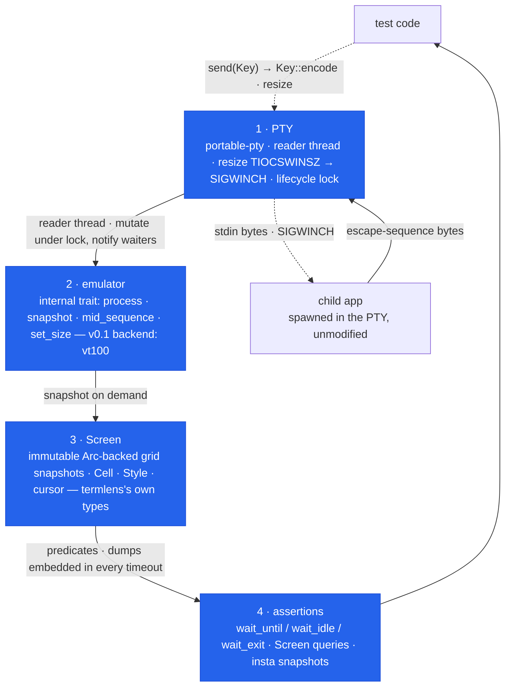

# termlens — Design

Condensed architecture notes. This document is the contract for anything
touching wait semantics, the snapshot format, or the emulator boundary —
change those only with a matching change here.

## 1. Four layers



Data flows up (solid): child writes → PTY master → reader thread →
emulator → screen snapshots → assertions. Input flows down (dashed):
`Key::encode()` → PTY master → child.

**The reader thread** is the linchpin. It drains the PTY *continuously*, not
just inside `wait_*` calls, so a chatty program can never fill the kernel
PTY buffer and deadlock, and no output is lost "between" waits. It owns
nothing but a reader handle and the shared `Monitor<EmuState>` (mutex +
condvar): every chunk is fed to the emulator under the lock, then waiters
are notified. On EOF (child exited and released the terminal — reported as
0-read on macOS, EIO on Linux) it sets the `eof` flag and exits. It is
never joined: a grandchild holding the PTY open must not hang `Drop`.

### The reader answers queries

Applications ask their terminal questions — DSR `CSI 6 n` (cursor
position), DA1/DA2 (device attributes), `CSI 18 t` (text-area size),
`OSC 10/11 ; ?` (colors) — and block on the reply. A mute harness turns
every capability probe into a hang. termlens therefore answers, by
default, exactly what a real terminal answers and nothing more: the DA1
identity is VT220-with-color (`?62;22c`), claiming no feature the
emulator cannot render, and kitty's `CSI ? u` probe is deliberately left
unanswered because its protocol resolves via the DA1 reply, exactly as
on a real non-kitty terminal.

Precision: the emulator stops consuming at each query byte (the same
mechanism as frame boundaries), so a cursor-position report reflects the
cursor *at the query*, not after later output in the same chunk moved
it. Replies are built under the state lock but written after it is
released — the state lock and the writer lock are never held together.

Whatever remains unanswered (XTGETTCAP, pixel-size reports, …) is
recorded, and the next wait timeout names it: "the application queried
the terminal (`^[[14t`) and received no answer" — a hang becomes a
diagnosis. `answer_queries(false)` mutes the responder for tests that
need a silent terminal; the diagnosis still works.

## 2. Wait semantics

Every wait runs under the terminal's **default deadline** (builder
`timeout`, 5s default). There is deliberately no unbounded wait: a hung
TUI in CI must produce a readable failure, not a 6-hour job timeout. On
expiry the error **embeds the full screen dump** — a CI log alone answers
"what was the app showing?".

- `wait_until(pred)` — re-evaluates `pred` on a fresh snapshot whenever the
  reader delivers bytes (condvar notification), with a 50ms poll cap as a
  missed-wakeup backstop. Fails fast with `Error::Eof` the moment the PTY
  closes while `pred` is false: more waiting can never succeed.
- `wait_frame(pred)` — evaluates `pred` **only on complete frames**. The
  sequence tracker recognizes DEC private mode 2026 (`CSI ?2026 h/l`,
  including multi-mode lists); the reader splits each chunk at every
  frame end and snapshots the screen *at that instant*, so the predicate
  sees exactly the frame as the app finished it — even when the same read
  already carries the next frame's opening bytes. The frame completed
  most recently before the call is evaluated first (fast apps can't slip
  a frame past the wait). Honest caveat: frames that complete within one
  read burst supersede each other — `wait_frame` guarantees
  frame-consistent screens, not observation of every transient frame. An
  app that never emits a synchronized update makes the timeout error say
  so and point at `wait_until`.
- `wait_idle(quiet)` — resolves when **no bytes for `quiet`** AND the
  stream does not end mid-escape-sequence (or mid-UTF-8-character) AND no
  synchronized update is open (a begun-but-unfinished DEC 2026 repaint is
  by definition mid-update). The sequence conditions come from a minimal
  tracker (`emu/seq.rs`) — not a VT parser, just enough state to answer
  "did the stream stop inside an update?". EOF counts as idle. **This is
  a heuristic**: silence is evidence of a finished render, not proof.
  Prefer `wait_until` on visible content, or `wait_frame` where the app
  uses synchronized output.
- `wait_exit()` — polls `try_wait` on a capped backoff ladder (1→20ms),
  then grace-drains the PTY (≤500ms) so the final screen is complete
  before returning. Idempotent via a cached status.

`Drop` kills + reaps the child unconditionally (unless already reaped):
tests never leak zombies, including on panic.

### Snapshot after waiting on the *last* drawn byte

`wait_until(pred)` guarantees exactly this: every byte up to and including
the ones that made `pred` true has been processed. Bytes the application
wrote *after* your marker may still be in flight. So before snapshotting a
whole screen, wait on the **final** thing the app draws — the bottom-right
corner of a frame, or the cursor's resting position
(`s.cursor() == (row, 0, true)`) — not on a line drawn midway. Waiting on
an early marker and snapshotting is a race at chunk boundaries; the stress
workflow found exactly that in our own suite.

### The instant-exit caveat (macOS PTY teardown)

A child that **writes and exits within its first milliseconds** races the
platform's PTY teardown: on macOS, bytes still buffered in the kernel when
the slave side closes can be discarded, and teardown can even surface as a
signal-death instead of the real exit code. Stress-testing found this at
roughly 1 in 80 instant-exit spawns under load. termlens narrows the window
as far as userspace allows — the reader thread is attached *before* the
child is spawned — but cannot close it.

The deterministic pattern (used throughout our own suite): make the child's
last action a `read` on stdin, assert on its output, then send Enter and
`wait_exit`. Real TUI applications are unaffected — they live far longer
than the window and exit on request.

Related, and fixed inside the library: macOS tears PTYs down with
`revoke()` and recycles PTY device numbers immediately, so with concurrent
terminals one thread's teardown could revoke another thread's *freshly
opened* PTY and kill its child at birth (~1/800 spawns under CI load; the
same suite ran 100/100 on Linux). termlens therefore serializes every PTY
lifecycle edge — open+spawn on one side, kill+reap+close on the other —
behind a process-wide lock (`PTY_LIFECYCLE` in `terminal.rs`). The lock is
held for microseconds per edge; steady-state I/O never touches it.

## 3. Snapshot text format (spec)

`Display for Screen` produces:

```
size: 80x24  cursor: 2,3
╭──────────────────────────────╮
│ repoatlas                    │
│ > main.go                    │
╰──────────────────────────────╯
```

Rules:

1. Header line first: `size: <cols>x<rows>  cursor: <row>,<col>` — two
   spaces between the fields; cursor coordinates are `row,col` zero-based.
   A hidden cursor renders as `cursor: hidden` (TUIs hide the cursor
   deliberately; snapshots should say so).
2. Then the grid **verbatim**, one terminal row per line, top to bottom.
3. **Trailing whitespace is stripped per line** (snapshot files stay
   readable and diff-able), but blanks are *preserved inside* the `Screen`
   grid, so `cell()`, `row_text()`, and `find()` coordinates are unaffected.
4. Wide characters occupy their real columns: the character appears once;
   its continuation cell contributes nothing to the text but does count
   for column arithmetic (`find` returns true terminal columns).
5. Styles are text-invisible by default; `Screen::with_styles()` opts in.
   Its rendering is the plain `Display` output followed by a blank line
   and a `styles:` block:

   ```
   styles:
   1: 0-8 fg=4 bold; 12 reverse
   3: 0-79 bg=#1e1e2e
   ```

   One line per row containing any non-default cell, ascending; each line
   is `<row>: <spans>` with spans joined by `; `. A span is an inclusive,
   0-based column range (`start-end`, or just `start` for one column)
   followed by style tokens in fixed order: `fg=`, `bg=` (indexed colors
   as decimal, RGB as `#rrggbb`), then `bold`, `dim`, `italic`,
   `underline`, `reverse`. Default-styled spans are omitted entirely —
   absence means default — so a highlight moving rows diffs as exactly
   two lines. A fully default-styled screen renders `styles:` followed by
   `(none)`, so the snapshot itself records that styles were asserted.
   Wide-character continuation cells participate in spans like any other
   cell.

The `insta` feature (default) re-exports `insta` and ships
`assert_screen_snapshot!` so the snapshotting insta version can't drift
from the one the macro targets.

## 4. Emulator abstraction — why

`vt100` is the v0.1 backend: small, pure, battle-tested by its own suite.
But it is an implementation detail:

- Public types (`Screen`, `Cell`, `Style`, `Color`) are termlens's own.
  vt100 types never appear in the API, so swapping the backend is a
  non-breaking change.
- The `Emulator` trait is four methods (`process`, `snapshot`,
  `mid_sequence`, `set_size`) — deliberately the *narrowest* surface that
  the terminal loop needs, so candidate backends (wezterm-term for wider
  escape coverage, alacritty_terminal for fidelity to a real terminal's
  quirks) can be evaluated behind a feature flag without touching layer 3+.
- Known vt100 limits we accept in v0.1: no scrollback assertions (parser
  runs with scrollback 0), no reflow of scrollback on resize, cluster
  handling for exotic emoji is whatever vt100 does (pinned by the
  unicode-torture snapshot rather than promised).

## 5. Environment policy

Tests must be hermetic. `TERM=xterm-256color` is always set (unless the
test overrides it) so escape output matches what the emulator speaks
regardless of host. `env_clear()` blocks inheritance while keeping
`env()`-set variables — order-independent, unlike `std::process::Command`,
because a builder that silently drops your explicit `TERM` depending on
call order is a trap.

## 6. Input encoding

Mouse input is **mode-aware**: the emulator knows which tracking mode and
encoding the application enabled (`?9/?1000/?1002/?1003`, SGR `?1006`),
`click`/`scroll` encode to match, and no tracking enabled is a typed
error — never bytes the application would misparse as keys.

`Key::encode` maps to xterm *default-mode* sequences (CSI arrows, SS3
F1–F4, CSI-tilde function keys, DEL for Backspace). Applications that
enable application-cursor mode (DECCKM) still parse the CSI forms in every
mainstream input stack, so v0.1 does not track terminal modes for output.
If a real-world app under test needs mode-aware encoding, the emulator
already knows the mode — the hook exists, the complexity is deferred until
someone actually needs it.
